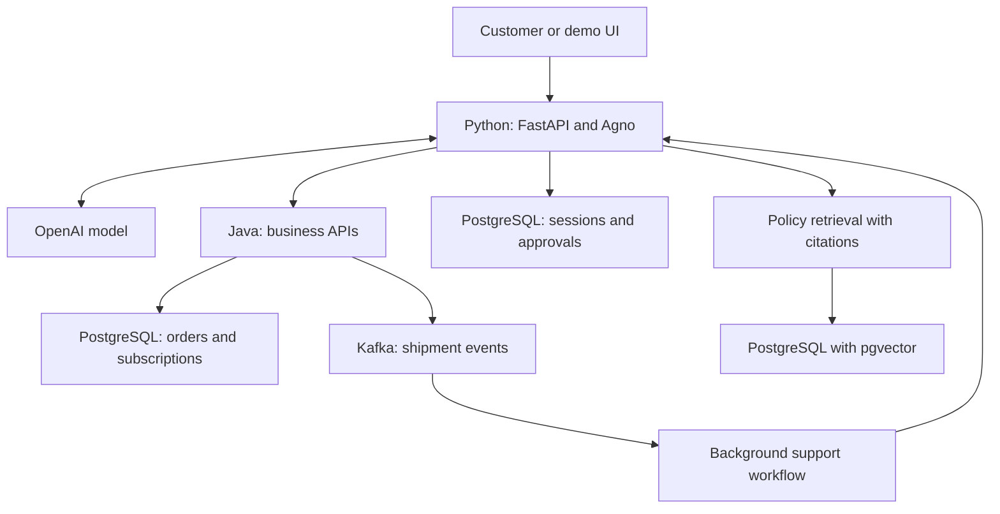

# Target architecture

This diagram describes the intended completed project. Phase 0 contains the Python API shell and PostgreSQL infrastructure only.

These PostgreSQL boxes represent separate logical stores or schemas, with appropriately scoped database roles. We can initially run them on the same PostgreSQL instance. The Python agent will access order and subscription records through Java business APIs; database access for session storage or policy retrieval has a separate purpose.

## Responsibilities

| Component | Responsibility | Introduced |
| --- | --- | --- |
| Python agent service | Conversation, tool selection, contextual responses, and approval flow | Foundation in Phase 0; actual agent in Phase 2 |
| Java business service | Order, shipment, subscription and ticket APIs; ownership checks; state transitions; idempotency | Phase 1 onward |
| OpenAI model | Interpret requests, request tools, and explain verified results | Phase 2 |
| Session storage | Preserve each user's conversation across service restarts | Phase 2 |
| Authentication | Establish trusted identity and enforce resource ownership | Phase 3 |
| Policy retrieval | Retrieve versioned policy excerpts and return citations | Phase 4 |
| Approval storage | Persist pending actions and authorization context | Phase 5 |
| Kafka workflow | Trigger support investigation for delayed-shipment events | Phase 6 |
| Observability | Trace tools and requests; measure latency, errors and token use | Phase 7 |

## Example completed workflow

1. A signed-in customer asks why a printer has not arrived.
2. The agent retrieves the customer's order through the Java API.
3. It fetches shipment details and uses the latest status reported by the shipment simulator.
4. It retrieves the applicable delivery policy and cites the policy version.
5. It explains the recorded problem and proposes a support ticket.
6. The customer confirms or rejects the proposed action.
7. On approval, the Java service rechecks ownership and relevant business state, creates one ticket under an idempotency key, and records an audit event.
8. A subsequent customer question continues the same user's session.

The LLM selects tools and writes explanations. The Java service owns authorization, cancellation/refund eligibility rules, and database transactions. The model does not grant permissions or decide financial eligibility by itself.

## First implementation choices

- Start with one agent and one Java business service.
- Use synthetic customer, order and shipment data.
- Introduce dependency versions in the phase that needs them and pin the verified versions.
- Introduce pgvector and Kafka only when their workflows are implemented.
- Each new tool must have a clear contract and a defined failure response.
- Human approval is required for the demo's cancellation and refund actions.
- A specialist-agent extension can be considered after the single-agent workflow is reliable, with tool and context boundaries that justify the split.
