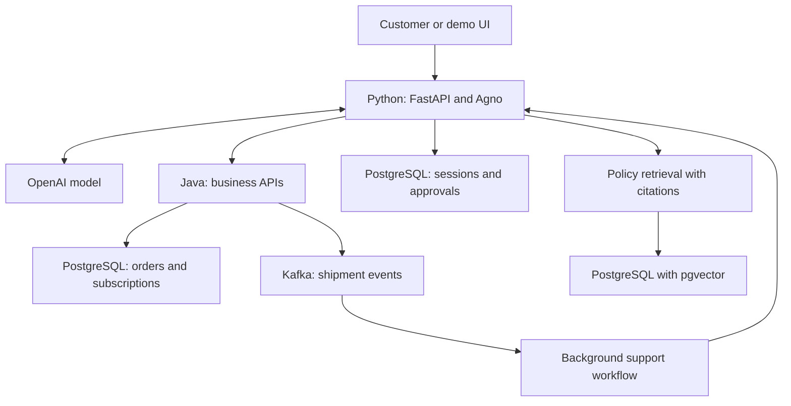

# Order and Subscription Support Agent — Phase 0 guide

We will build this project in small local phases, with complete files and a GitHub checkpoint at the end of each phase. The target stack is Python with Agno/FastAPI for agent orchestration, Java 21 with Spring Boot for business APIs, and PostgreSQL for persistence. Kafka and policy retrieval arrive when their use cases are ready. AWS deployment follows local acceptance checks.

This package implements **Phase 0: local foundation**. It starts an API and checks PostgreSQL connectivity. The order APIs start in Phase 1 and the actual LLM agent starts in Phase 2.

## How to use this package

Choose one approach:

- Extract `order-support-agent-phase-0.zip` and open the resulting `order-support-agent` folder in your editor.
- Create the directories below, then type or copy each source file from this guide into its exact path.

For the manual route:

```bash
mkdir -p order-support-agent/agent-service/app order-support-agent/agent-service/tests order-support-agent/docs
cd order-support-agent
```

For the ZIP route, run `cd order-support-agent` from the directory where you extracted it. Every following command assumes you are in the project root, unless stated otherwise.

## Step 1: confirm prerequisites

Use Python 3.12, Docker Desktop with Docker Compose, and Git. Java 21 is needed starting in Phase 1.

```bash
python3.12 --version
docker --version
docker compose version
git --version
```

Start Docker Desktop before starting PostgreSQL. If `python3.12` is missing, install Python 3.12 using the official macOS installer or your existing package manager; the commands below deliberately use that interpreter to create the virtual environment.

Official setup references:

- Python downloads: https://www.python.org/downloads/
- Docker Desktop for Mac: https://docs.docker.com/desktop/setup/install/mac-install/
- FastAPI environment settings: https://fastapi.tiangolo.com/advanced/settings/
- Psycopg connections: https://www.psycopg.org/psycopg3/docs/basic/usage.html

## Step 2: create these files

The file list below is the complete Phase 0 source. The ZIP also includes a README, this guide, the full roadmap, and the planned architecture.

| File | Purpose |
| --- | --- |
| `.gitignore` | Keep local secrets and generated files out of Git. |
| `.python-version` | Declare the Python version used for this phase. |
| `.env.example` | Provide local development configuration to copy into .env. |
| `compose.yaml` | Run PostgreSQL locally with a health check and persistent volume. |
| `agent-service/requirements.txt` | Pin the runtime dependencies verified for this phase. |
| `agent-service/requirements-dev.txt` | Add the HTTP test client used by the installed Starlette version. |
| `agent-service/app/__init__.py` | Declare the app Python package. |
| `agent-service/app/config.py` | Load and validate settings from the root .env and environment variables. |
| `agent-service/app/database.py` | Check PostgreSQL connectivity using a bounded SELECT 1 probe. |
| `agent-service/app/main.py` | Expose liveness and readiness endpoints through FastAPI. |
| `agent-service/tests/test_health.py` | Verify health contracts and failure-data handling. |

### `.gitignore`

Keep local secrets and generated files out of Git.

```text
.env
.env.*
!.env.example
.venv/
__pycache__/
*.py[cod]
.pytest_cache/
.coverage
htmlcov/
*.egg-info/
target/
.idea/
.vscode/
.DS_Store
*.log
```

### `.python-version`

Declare the Python version used for this phase.

```text
3.12
```

### `.env.example`

Provide local development configuration to copy into .env.

```dotenv
APP_NAME=order-support-agent
APP_ENV=local
POSTGRES_HOST=127.0.0.1
POSTGRES_PORT=5433
POSTGRES_DB=order_support
POSTGRES_USER=support_app
POSTGRES_PASSWORD=local_demo_password
```

### `compose.yaml`

Run PostgreSQL locally with a health check and persistent volume.

```yaml
name: order-support-agent

services:
  postgres:
    image: postgres:16
    environment:
      POSTGRES_DB: ${POSTGRES_DB:?Copy .env.example to .env first}
      POSTGRES_USER: ${POSTGRES_USER:?Set POSTGRES_USER in .env}
      POSTGRES_PASSWORD: ${POSTGRES_PASSWORD:?Set POSTGRES_PASSWORD in .env}
    ports:
      - "127.0.0.1:${POSTGRES_PORT:-5433}:5432"
    volumes:
      - postgres_data:/var/lib/postgresql/data
    healthcheck:
      test: ["CMD-SHELL", "pg_isready -h 127.0.0.1 -U \"$${POSTGRES_USER}\" -d \"$${POSTGRES_DB}\""]
      interval: 5s
      timeout: 3s
      retries: 10
      start_period: 10s

volumes:
  postgres_data:
```

### `agent-service/requirements.txt`

Pin the runtime dependencies verified for this phase.

```text
fastapi==0.142.4
starlette==1.7.0
uvicorn==0.54.0
pydantic==2.13.5
pydantic-settings==2.15.0
psycopg[binary]==3.3.6
```

### `agent-service/requirements-dev.txt`

Add the HTTP test client used by the installed Starlette version.

```text
-r requirements.txt
httpx2==2.13.1
```

### `agent-service/app/__init__.py`

Declare the app Python package.

```python
"""Order and Subscription Support Agent API."""
```

### `agent-service/app/config.py`

Load and validate settings from the root .env and environment variables.

```python
from pathlib import Path
from typing import Literal

from pydantic import Field, SecretStr
from pydantic_settings import BaseSettings, SettingsConfigDict


PROJECT_ROOT = Path(__file__).resolve().parents[2]


class Settings(BaseSettings):
    model_config = SettingsConfigDict(
        env_file=PROJECT_ROOT / ".env",
        env_file_encoding="utf-8",
        extra="ignore",
    )

    app_name: str = "order-support-agent"
    app_env: Literal["local", "test", "production"] = "local"
    postgres_host: str = "127.0.0.1"
    postgres_port: int = Field(default=5433, ge=1, le=65535)
    postgres_db: str = "order_support"
    postgres_user: str = "support_app"
    postgres_password: SecretStr = Field(min_length=1)
```

### `agent-service/app/database.py`

Check PostgreSQL connectivity using a bounded SELECT 1 probe.

```python
import logging

import psycopg

from app.config import Settings


logger = logging.getLogger(__name__)


def database_is_ready(settings: Settings) -> bool:
    """Check connectivity without returning connection details to the caller."""
    try:
        with psycopg.connect(
            host=settings.postgres_host,
            port=settings.postgres_port,
            dbname=settings.postgres_db,
            user=settings.postgres_user,
            password=settings.postgres_password.get_secret_value(),
            connect_timeout=3,
            options="-c statement_timeout=3000",
            autocommit=True,
        ) as connection:
            return connection.execute("SELECT 1").fetchone() == (1,)
    except psycopg.Error as exc:
        logger.warning("Database readiness check failed: %s", type(exc).__name__)
        return False
```

### `agent-service/app/main.py`

Expose liveness and readiness endpoints through FastAPI.

```python
from fastapi import FastAPI, Response, status

from app.config import Settings
from app.database import database_is_ready


def create_app(settings: Settings | None = None) -> FastAPI:
    settings = settings if settings is not None else Settings()
    api = FastAPI(
        title="Order and Subscription Support Agent",
        description="Phase 0: local API and PostgreSQL readiness checks.",
        version="0.1.0",
    )

    @api.get("/health/live", tags=["Health"])
    def liveness() -> dict[str, str]:
        return {
            "status": "UP",
            "service": settings.app_name,
            "environment": settings.app_env,
        }

    @api.get(
        "/health/ready",
        tags=["Health"],
        responses={503: {"description": "PostgreSQL is unavailable"}},
    )
    def readiness(response: Response) -> dict[str, str]:
        ready = database_is_ready(settings)
        if not ready:
            response.status_code = status.HTTP_503_SERVICE_UNAVAILABLE
        return {
            "status": "UP" if ready else "DOWN",
            "service": settings.app_name,
            "database": "UP" if ready else "DOWN",
        }

    return api


app = create_app()
```

### `agent-service/tests/test_health.py`

Verify health contracts and failure-data handling.

```python
import os
import unittest
from unittest.mock import patch

import psycopg
from fastapi.testclient import TestClient


# Tests run without a .env file and never contact a real database.
with patch.dict(os.environ, {"POSTGRES_PASSWORD": "unit-test-only"}):
    from app.config import Settings
    from app.main import create_app


class HealthTests(unittest.TestCase):
    def setUp(self):
        settings = Settings(
            _env_file=None,
            app_env="test",
            postgres_password="unit-test-only",
        )
        self.client = TestClient(create_app(settings))
        self.addCleanup(self.client.close)

    def test_liveness_does_not_depend_on_database(self):
        with patch("app.database.psycopg.connect") as connect:
            response = self.client.get("/health/live")
        self.assertEqual(response.status_code, 200)
        self.assertEqual(response.json()["status"], "UP")
        connect.assert_not_called()

    def test_readiness_succeeds_when_database_responds(self):
        with patch("app.database.psycopg.connect") as connect:
            connection = connect.return_value.__enter__.return_value
            connection.execute.return_value.fetchone.return_value = (1,)
            response = self.client.get("/health/ready")
        self.assertEqual(response.status_code, 200)
        self.assertEqual(response.json()["database"], "UP")

    def test_database_failure_returns_503_without_sensitive_details(self):
        with patch(
            "app.database.psycopg.connect",
            side_effect=psycopg.OperationalError("password=do-not-expose"),
        ):
            with self.assertLogs("app.database", level="WARNING") as logs:
                response = self.client.get("/health/ready")
        self.assertEqual(response.status_code, 503)
        self.assertEqual(response.json()["status"], "DOWN")
        self.assertNotIn("do-not-expose", response.text)
        self.assertNotIn("do-not-expose", " ".join(logs.output))


if __name__ == "__main__":
    unittest.main()
```

## Step 3: create local configuration

From the project root, create `.env` once:

```bash
cp .env.example .env
```

The sample credentials are only for this local synthetic-data environment. `.env.example` is committed; `.env` is excluded by .gitignore. Later AWS phases use separate runtime secrets.

PostgreSQL listens on port **5433 on your Mac** and **5432 inside its container**. Both Compose and the Python service read POSTGRES_PORT from the root .env, so changing that one value updates the local host port consistently.

## Step 4: create and activate the Python environment

```bash
python3.12 -m venv .venv
source .venv/bin/activate
python -m pip install -r agent-service/requirements-dev.txt
```

Select `.venv/bin/python` as the Python interpreter in your editor. In each new terminal where you run Python commands, activate the environment again. Package versions in this phase were installed and verified with Python 3.12.14.

`requirements.txt` contains runtime packages. `requirements-dev.txt` adds the HTTP test client. The tests use Python's built-in unittest module.

## Step 5: start PostgreSQL

```bash
docker compose up -d --wait postgres
docker compose ps
```

Expect the PostgreSQL service to report `healthy`. The Compose health check tests the container's TCP listener. Docker Compose's --wait option waits for the configured health condition.

Verify an actual SQL connection:

```bash
docker compose exec postgres sh -c 'psql -U "$POSTGRES_USER" -d "$POSTGRES_DB" -c "SELECT current_database(), current_user;"'
```

Expected values: database `order_support`, user `support_app`.

Business tables and synthetic orders are introduced through migrations in Phase 1.

## Step 6: start the Python API

Keep this terminal open:

```bash
python -m uvicorn app.main:app --app-dir agent-service --host 127.0.0.1 --port 8000 --reload
```

Expected startup includes `Application startup complete` and a local URL on port 8000. Open http://127.0.0.1:8000/docs for interactive API documentation.

- `app.main:app` identifies the Python module and the FastAPI application instance.
- `--app-dir agent-service` makes the app package importable while commands run from the repository root.
- `--reload` restarts the development server after source edits.
- The application loads the root .env using an absolute path derived from config.py, so it does not depend on the terminal's current directory to find the settings file.

## Step 7: verify health endpoints

Open a second terminal at the project root and run:

```bash
curl -i http://127.0.0.1:8000/health/live
curl -i http://127.0.0.1:8000/health/ready
```

Expected liveness response: HTTP 200, with:

```json
{"status":"UP","service":"order-support-agent","environment":"local"}
```

Expected readiness response: HTTP 200, with:

```json
{"status":"UP","service":"order-support-agent","database":"UP"}
```

Liveness checks whether the API process can answer. Readiness also opens a PostgreSQL connection and runs SELECT 1. This separation makes dependency failures visible without falsely claiming the process has crashed.

## Step 8: run the tests

In a terminal at the project root:

```bash
source .venv/bin/activate
PYTHONPATH=agent-service python -m unittest discover -s agent-service/tests -v
```

Expect three tests and `OK`. The tests use mocked database connections, so they do not require Docker, an OpenAI key, or a populated database. The real database check in Steps 5 and 7 is separate.

## Step 9: try one dependency-failure scenario

While the API is running:

```bash
docker compose stop postgres
curl -i http://127.0.0.1:8000/health/live
curl -i http://127.0.0.1:8000/health/ready
```

Expect liveness HTTP 200 and readiness HTTP 503. The readiness body reports DOWN without returning connection credentials or raw database errors.

Restore PostgreSQL:

```bash
docker compose up -d --wait postgres
curl -i http://127.0.0.1:8000/health/ready
```

Expect readiness HTTP 200 again.

## Step 10: Phase 0 completion checklist

- Python environment activates and dependencies install.
- PostgreSQL container reports healthy.
- The SQL verification returns the expected database and user.
- Both health endpoints return HTTP 200 with PostgreSQL running.
- All three tests pass.
- The dependency-failure scenario returns the expected 503 and recovers.
- `.env` and `.venv/` are excluded from the Git commit.

## Step 11: first GitHub checkpoint

Create an empty GitHub repository named `order-support-agent`. Leave automatic README, license and .gitignore initialization unchecked because the local project supplies its own files.

After the completion checklist passes, run from the local project root:

```bash
git init -b main
git add .
git status --short
git check-ignore .env .venv/
git diff --cached --stat
git commit -m "Phase 0: local API and database foundation"
git remote add origin git@github.com:YOUR_GITHUB_USERNAME/order-support-agent.git
git push -u origin main
git tag -a phase-0 -m "Phase 0 complete"
git push origin phase-0
```

Replace YOUR_GITHUB_USERNAME. Use the SSH URL if GitHub SSH authentication is configured. Alternatively, replace just the remote-add line with:

```bash
git remote add origin https://github.com/YOUR_GITHUB_USERNAME/order-support-agent.git
```

Run one remote-add command. If Git requires identity, configure your name and GitHub-associated email for this repository before the commit. GitHub account passwords are not used for HTTPS Git authentication; use your configured supported authentication method.

`git check-ignore` should print `.env` and `.venv/`. The staged file list should include `.env.example`. Inspect the staged changes before committing.

## Troubleshooting

| Symptom | Check or correction |
| --- | --- |
| docker daemon is unavailable | Start Docker Desktop and retry docker compose ps. |
| python3.12 is not found | Install Python 3.12 or use the absolute path to its installed interpreter when creating .venv. |
| POSTGRES_PASSWORD validation error | Copy .env.example to the project-root .env; check the variable name and non-empty value. |
| Port 5433 is already allocated | Choose an unused POSTGRES_PORT in .env, recreate the postgres service, and restart the API. |
| Port 8000 is already in use | Stop the other development server or start Uvicorn on another port and adjust the curl URLs. |
| PostgreSQL password authentication fails after editing .env | The named volume preserves the credentials set at database creation. Use the original local credentials or intentionally change the database user's password; changing .env alone does not reset an initialized database. |
| No module named app | Run from the project root with --app-dir agent-service, or use PYTHONPATH=agent-service for tests. |
| /health/live is UP but /health/ready is DOWN | Check docker compose ps and docker compose logs --tail=30 postgres; then verify host, port and credentials. |
| A GitHub push is rejected | Confirm the remote URL, repository access and authentication. An empty remote avoids conflicts with an automatically created README. |

Stop Uvicorn with Ctrl+C. Stop PostgreSQL while retaining its volume:

```bash
docker compose down
```

## Verification performed on this package

- All Python source files parsed successfully.
- All three health contract/failure-handling tests passed.
- A real Uvicorn HTTP process returned 200 for /health/live and /docs.
- With a deliberately unavailable PostgreSQL endpoint, the live service returned 503 for /health/ready without exposing sensitive error text.
- Compose YAML parsed successfully and Git ignore behaviour was checked.

Docker is not installed in the environment where this package was created. A real PostgreSQL container and the successful live SQL connection must be verified on your local machine using Steps 5 and 7. A mocked readiness success is not evidence that an actual database container was started here.

## What comes next

Phase 1 adds a Java 21/Spring Boot business service, database migrations, and synthetic customer/order/shipment/subscription data. We will verify its read APIs before connecting the LLM in Phase 2.

## Complete project roadmap and phase-end Git commands

# Build roadmap and GitHub checkpoints

The core goal is a working Order and Subscription Support Agent that investigates customer issues, uses trusted business APIs, retrieves policy evidence, and executes approved actions. Build each phase locally, complete its gate, and then commit it. AWS deployment starts after the local acceptance checks pass.

Each phase will be taught with: the goal, new or changed files with complete contents, commands to run, expected outputs, failure cases, a completion checklist, and a GitHub checkpoint.

## Feature roadmap

| Phase | Outcome | Completion gate |
| --- | --- | --- |
| 0 | **Local foundation**: Python API, validated configuration, PostgreSQL Compose, liveness/readiness checks. | All three tests pass; real PostgreSQL is healthy; /health/live and /health/ready return HTTP 200. |
| 1 | **Java business APIs**: Java 21 and Spring Boot; PostgreSQL migrations; synthetic customers, orders, shipments and subscriptions; read APIs with explicit errors. | Known and unknown tracking IDs have defined responses; shipment/subscription APIs work; business API tests pass. |
| 2 | **Working AI agent**: Agno + OpenAI; narrow tools that call Java APIs; order/shipment/subscription lookup; persistent user/session identifiers; typed tool responses. | The agent asks for missing IDs, queries actual demo records, handles unknown IDs, and resumes a saved conversation. |
| 3 | **Authentication and isolation**: JWT identity, resource ownership, separate customer sessions, role checks, scoped tool access, sensitive-data masking. | Customer A cannot access customer B's orders, sessions, approvals or tickets through prompts or direct API calls. |
| 4 | **Policy retrieval**: RAG over versioned delivery/cancellation policies; PostgreSQL pgvector; metadata filtering; visible citations; explicit insufficient-evidence responses. | Answers cite the correct document/version; unsupported questions do not fabricate policy. |
| 5 | **Approved business actions**: Support tickets, cancellation/refund eligibility previews, persistent pending approvals, confirmation/rejection, idempotency and audit history. | Approval survives restart; rejected actions do not execute; retries create one effect; authorization and eligibility are rechecked at execution. |
| 6 | **Proactive shipment support**: Kafka shipment events, transactional outbox, idempotent consumers, bounded retries and dead-letter handling; background investigation and support drafts. | A synthetic delayed-shipment event produces one support draft; duplicate delivery does not duplicate actions; failed events are inspectable. |
| 7 | **Reliability and demo**: Regression/evaluation cases, tool traces, timeout handling, latency/token metrics, basic rate limits, Dockerfiles, local chat/approval screen and GitHub CI. | Local acceptance scenarios and CI pass; dependency outages have controlled responses; publish measured results with the test dataset. |
| 8 | **AWS learning deployment**: Deploy the locally verified containers on EC2; ECR images, IAM, security groups, CloudWatch and managed secrets; repeatable setup and teardown. | Authenticated end-to-end demo works on AWS; restart and error paths are checked; setup and cleanup commands are documented. |
| 9 | **Optional AWS deployment upgrade**: ECS Fargate, ALB, RDS PostgreSQL, private networking, S3 policy documents, Terraform and GitHub Actions using OIDC. | Cloud deployment is repeatable; health checks and logs work; rollback and cost/cleanup instructions are tested. |

## Scope choices

- Python owns agent orchestration; Java owns business rules and transactions.
- Begin with one business service. Separate order and subscription services only if a later requirement justifies it.
- Shipping and payment integrations use local simulators initially. Refund actions write simulated records rather than transfer real money.
- Notifications are shown in the demo UI or an internal notification record until an actual external integration is deliberately enabled.
- Kafka enters in Phase 6. Each phase should add a working use case before adding another dependency.
- Tests assert business behaviour and access boundaries. Agent evaluations check response evidence and tool selection/arguments.
- A multi-agent extension is optional. Evaluate whether a specialist agent improves quality or context isolation before splitting the workflow.

## Phase 0: first GitHub push

Create a new, empty GitHub repository named `order-support-agent`. Leave GitHub's README, license and .gitignore initialization unchecked because these files are already local. Copy its SSH URL after configuring GitHub SSH authentication. The HTTPS URL also works with GitHub's supported authentication methods.

From the local project root, after the Phase 0 completion gate passes:

```bash
git init -b main
git add .
git status --short
git check-ignore .env .venv/
git diff --cached --stat
git commit -m "Phase 0: local API and database foundation"
git remote add origin git@github.com:YOUR_GITHUB_USERNAME/order-support-agent.git
git push -u origin main
git tag -a phase-0 -m "Phase 0 complete"
git push origin phase-0
```

Replace `YOUR_GITHUB_USERNAME` with your GitHub username. `.env` and `.venv/` must be ignored; `.env.example` should be committed. If Git asks for identity, configure your name and GitHub-associated email for this repository before committing. Do not rerun `git init` or `git remote add` for later phases.

For HTTPS, replace the remote-add line with:

```bash
git remote add origin https://github.com/YOUR_GITHUB_USERNAME/order-support-agent.git
```

Run one remote-add command, choosing the URL that matches your configured GitHub authentication.

## Phase 1: Java business APIs

Implement: Java 21 and Spring Boot; PostgreSQL migrations; synthetic customers, orders, shipments and subscriptions; read APIs with explicit errors.

Complete before committing: Known and unknown tracking IDs have defined responses; shipment/subscription APIs work; business API tests pass.

Run the phase-specific tests and local acceptance commands supplied with that phase. Then, from the project root:

```bash
git add .
git status --short
git diff --cached --stat
git commit -m "Phase 1: order shipment and subscription apis"
git push origin main
git tag -a phase-1 -m "Phase 1 complete"
git push origin phase-1
```

## Phase 2: Working AI agent

Implement: Agno + OpenAI; narrow tools that call Java APIs; order/shipment/subscription lookup; persistent user/session identifiers; typed tool responses.

Complete before committing: The agent asks for missing IDs, queries actual demo records, handles unknown IDs, and resumes a saved conversation.

Run the phase-specific tests and local acceptance commands supplied with that phase. Then, from the project root:

```bash
git add .
git status --short
git diff --cached --stat
git commit -m "Phase 2: ai agent with api tools and session history"
git push origin main
git tag -a phase-2 -m "Phase 2 complete"
git push origin phase-2
```

## Phase 3: Authentication and isolation

Implement: JWT identity, resource ownership, separate customer sessions, role checks, scoped tool access, sensitive-data masking.

Complete before committing: Customer A cannot access customer B's orders, sessions, approvals or tickets through prompts or direct API calls.

Run the phase-specific tests and local acceptance commands supplied with that phase. Then, from the project root:

```bash
git add .
git status --short
git diff --cached --stat
git commit -m "Phase 3: authentication ownership and session isolation"
git push origin main
git tag -a phase-3 -m "Phase 3 complete"
git push origin phase-3
```

## Phase 4: Policy retrieval

Implement: RAG over versioned delivery/cancellation policies; PostgreSQL pgvector; metadata filtering; visible citations; explicit insufficient-evidence responses.

Complete before committing: Answers cite the correct document/version; unsupported questions do not fabricate policy.

Run the phase-specific tests and local acceptance commands supplied with that phase. Then, from the project root:

```bash
git add .
git status --short
git diff --cached --stat
git commit -m "Phase 4: policy retrieval with citations"
git push origin main
git tag -a phase-4 -m "Phase 4 complete"
git push origin phase-4
```

## Phase 5: Approved business actions

Implement: Support tickets, cancellation/refund eligibility previews, persistent pending approvals, confirmation/rejection, idempotency and audit history.

Complete before committing: Approval survives restart; rejected actions do not execute; retries create one effect; authorization and eligibility are rechecked at execution.

Run the phase-specific tests and local acceptance commands supplied with that phase. Then, from the project root:

```bash
git add .
git status --short
git diff --cached --stat
git commit -m "Phase 5: approval workflows and idempotent actions"
git push origin main
git tag -a phase-5 -m "Phase 5 complete"
git push origin phase-5
```

## Phase 6: Proactive shipment support

Implement: Kafka shipment events, transactional outbox, idempotent consumers, bounded retries and dead-letter handling; background investigation and support drafts.

Complete before committing: A synthetic delayed-shipment event produces one support draft; duplicate delivery does not duplicate actions; failed events are inspectable.

Run the phase-specific tests and local acceptance commands supplied with that phase. Then, from the project root:

```bash
git add .
git status --short
git diff --cached --stat
git commit -m "Phase 6: event-driven shipment support"
git push origin main
git tag -a phase-6 -m "Phase 6 complete"
git push origin phase-6
```

## Phase 7: Reliability and demo

Implement: Regression/evaluation cases, tool traces, timeout handling, latency/token metrics, basic rate limits, Dockerfiles, local chat/approval screen and GitHub CI.

Complete before committing: Local acceptance scenarios and CI pass; dependency outages have controlled responses; publish measured results with the test dataset.

Run the phase-specific tests and local acceptance commands supplied with that phase. Then, from the project root:

```bash
git add .
git status --short
git diff --cached --stat
git commit -m "Phase 7: reliability observability and local demo"
git push origin main
git tag -a phase-7 -m "Phase 7 complete"
git push origin phase-7
```

## Phase 8: AWS learning deployment

Implement: Deploy the locally verified containers on EC2; ECR images, IAM, security groups, CloudWatch and managed secrets; repeatable setup and teardown.

Complete before committing: Authenticated end-to-end demo works on AWS; restart and error paths are checked; setup and cleanup commands are documented.

Run the phase-specific tests and local acceptance commands supplied with that phase. Then, from the project root:

```bash
git add .
git status --short
git diff --cached --stat
git commit -m "Phase 8: aws learning deployment"
git push origin main
git tag -a phase-8 -m "Phase 8 complete"
git push origin phase-8
```

## Phase 9: Optional AWS deployment upgrade

Implement: ECS Fargate, ALB, RDS PostgreSQL, private networking, S3 policy documents, Terraform and GitHub Actions using OIDC.

Complete before committing: Cloud deployment is repeatable; health checks and logs work; rollback and cost/cleanup instructions are tested.

Run the phase-specific tests and local acceptance commands supplied with that phase. Then, from the project root:

```bash
git add .
git status --short
git diff --cached --stat
git commit -m "Phase 9: managed aws deployment and infrastructure as code"
git push origin main
git tag -a phase-9 -m "Phase 9 complete"
git push origin phase-9
```

## Interview evidence to collect

- An architecture diagram that labels completed and planned components.
- One recorded end-to-end demo and a reproducible local run guide.
- Access-control cases for two synthetic customers.
- Tests for interrupted approvals and repeated action requests.
- An evaluation dataset and real measured results, including limitations.
- Tool traces showing the source of order facts and policy citations.
- A discussion of one failure scenario, how it was diagnosed, and how the design recovers.
- A clear distinction between personal project work and features used in a real production role.

## Planned architecture and responsibilities

# Target architecture

This diagram describes the intended completed project. Phase 0 contains the Python API shell and PostgreSQL infrastructure only.



These PostgreSQL boxes represent separate logical stores or schemas, with appropriately scoped database roles. We can initially run them on the same PostgreSQL instance. The Python agent will access order and subscription records through Java business APIs; database access for session storage or policy retrieval has a separate purpose.

## Responsibilities

| Component | Responsibility | Introduced |
| --- | --- | --- |
| Python agent service | Conversation, tool selection, contextual responses, and approval flow | Foundation in Phase 0; actual agent in Phase 2 |
| Java business service | Order, shipment, subscription and ticket APIs; ownership checks; state transitions; idempotency | Phase 1 onward |
| OpenAI model | Interpret requests, request tools, and explain verified results | Phase 2 |
| Session storage | Preserve each user's conversation across service restarts | Phase 2 |
| Authentication | Establish trusted identity and enforce resource ownership | Phase 3 |
| Policy retrieval | Retrieve versioned policy excerpts and return citations | Phase 4 |
| Approval storage | Persist pending actions and authorization context | Phase 5 |
| Kafka workflow | Trigger support investigation for delayed-shipment events | Phase 6 |
| Observability | Trace tools and requests; measure latency, errors and token use | Phase 7 |

## Example completed workflow

1. A signed-in customer asks why a printer has not arrived.
2. The agent retrieves the customer's order through the Java API.
3. It fetches shipment details and uses the latest status reported by the shipment simulator.
4. It retrieves the applicable delivery policy and cites the policy version.
5. It explains the recorded problem and proposes a support ticket.
6. The customer confirms or rejects the proposed action.
7. On approval, the Java service rechecks ownership and relevant business state, creates one ticket under an idempotency key, and records an audit event.
8. A subsequent customer question continues the same user's session.

The LLM selects tools and writes explanations. The Java service owns authorization, cancellation/refund eligibility rules, and database transactions. The model does not grant permissions or decide financial eligibility by itself.

## First implementation choices

- Start with one agent and one Java business service.
- Use synthetic customer, order and shipment data.
- Introduce dependency versions in the phase that needs them and pin the verified versions.
- Introduce pgvector and Kafka only when their workflows are implemented.
- Each new tool must have a clear contract and a defined failure response.
- Human approval is required for the demo's cancellation and refund actions.
- A specialist-agent extension can be considered after the single-agent workflow is reliable, with tool and context boundaries that justify the split.
